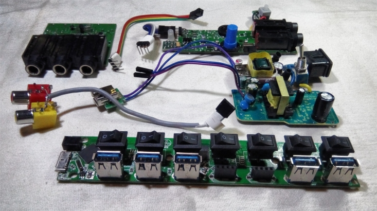
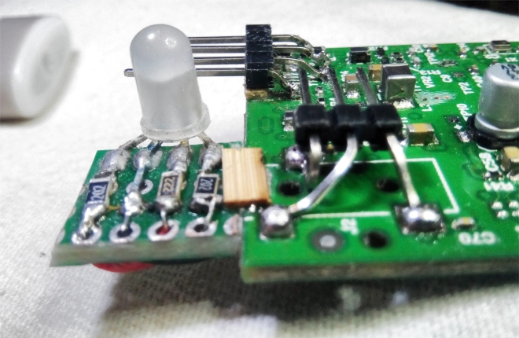

# SynthBox 1

This project reduces the clutter and complexity of my current rig for use in gigs.

### Old Rig

Before I got the Fishman Triple Play synth pickup for my guitar, my rig was fairly simple to setup.  It consisted of a multi-effects device and a loop pedal.  Over the years I'd had a variety of different loop pedals and multi-effects devices.  At the point I "retired" the old rig, it consisted of a Zoom G3 multi-effects pedal and a Boss RC-30 loop pedal.

I have/had evolved a very small rig, it easily fits into a Husky 19" tool bag, largely because, living on a boat in Panama, I have to transport all of the equipment to and fro by dinghy, and we often play outdoors and we get a lot of rain in Bocas (like 300 inches a year). So the equipment gets exposed to a lot of humidity and the occasional wetting at gigs, and more than once I have been caught in a tropical downpour when moving equipment to a gig, or worse, at 1:00am in the morning coming home from a gig.  Occasionally we have had to huff the equipment on a jungle trail for a quarter or half mile, so we also need to be able to carry it all (hence the small Stagepas 300 PA). I have good dry bags for everything, but still, there's a lot to move, I also move the P.A., mic-stands, and my guitar for each gig, so smaller is way better.

### Previous Rig

But when I got the FTP synth pickup and iPad working the first time back in November 2018, I immediately fell in love with it.  If for nothing more than being able to add a good sounding Bass to the mix, overlayed on certain strings with the guitar sound, that would be enough to make me change, but with the ability to add virtually ANY sound ... from classic instruments like piano, strings, horns, organ and piano to spacey environmental sounds and effect, the guitar synth (FTP+iPad) has really terrifically opened up the horizons of my sound, and I don't think there is any way for me to go back now.  It's just too much fun!

However, with all that new flexibility comes a new level of complexity.   Whereas in the old rig, I basically had two cables between four connectors, along with two wall warts, now all of a sudden I had something like 12 cables and 24 connectors to deal with.  Besides the fact that adds a lot of time to setting up and tearing down at each gig, a lot of the connectors are fragile "consumer" level connectors like 1/8" (3.5mm) jacks and micro-usb connectors.  So there's a lot of potential failure points, and they are more likely to fail than "pro music grade" 1/4" guitar cables.

### Meet the New Rig, same as the Previous Rig

I had joked around about it with my friend Chris .. that maybe I would just rip the guts (all the circuit boards) out of things and combine them into my own floor unit.  But, for other reasons, around the beginning of the year, I had started the [rPi Bare Metal vGuitar](https://hackaday.io/project/165696-rpi-bare-metal-vguitar-rig) project, and until about July I put most of my effort into that (still ongoing) project.

However, in August, I think, I got a 3D printer. Got addicted to it pretty quickly.  So actually what I've been doing for the last two months or so has centered itself on 3D printing.  I got into a string of "practical" projects for the boat that sometimes had nothing to do with music ... from parts for the head, to new lighting fixtures, to designing my own brushless DC fan.

So the vGuitar project has been lagging.  I figure I'm about 50% done with that as I have scoped it out to 18 months ... so I'm about 9 months into it at this point.

However, there is a growing need to start doing gigs again.  Apart from getting rusty, I need to make sure that I stay in the music cycle here in Bocas.  So about 3 weeks ago I decided to do just what I had described to Chris ... rip the guts out of various pieces of the previous rig, and solder or othrewise wire them together into a single box of some kind.  This is specifically to address the complexity and time of setup and to eliminate as many of the consumer connections and cables from the system as I can.

Here is a diagram showing how the box (SynthBox1) fits into the new rig

### What's in it?

So, I took five parts of the rig that each consisted, more or less, of a single circuit board inside a plastic box, removed the plastic boxes, modified the circuit boards as necessary, and combined them into a single plastic box.  In doing so, I replaced 5 little plastic boxes with one, and also eliminated 4-6 external cables and 10-12 external connectors.

The cables and connectors still exist ... they are just hardwired into the box itself.

So, the box contains the circuit boards from the following available devices (listed in order of cost);

#### Midi Expression Yellow

 **$139.00**  https://www.audiofront.net/MIDIExpression.php

I had purchased this box before I got into Arduino's and RPI's.  If I knew then what I know now :-) I would have probably just made my own equivilant box from a Teensy 3.6.  As I was working on some earlier projects, I had already examined the circuit board inside of this device.  LOL, I was somewhat surprised to find that in fact, it is the same MPU as is on the Teensy.  A bit more research at that point revealed that the box, and in fact the company that sells it, grew out of a kickstarter project doing this based on a Teensy.

It would be a fair, but not undoable effort to reproduce the functionality of this box for far less than $139.00.    But credit due, AudioFront provides very nice UI programs (at least on Windows) that allow you to configure and calibrate the device, and I have to remember that not everyone can afford to sit around and write software and give it away for free, so no dis intended.

In any case, it looks like a well designed board, and I have had no problems using it either in its dedicated role, or within this hack project.

#### IRig2 HD

 **$79.00 to $99.00 on ebay**  https://www.ebay.com/itm/IK-Multimedia-iRig-HD-2-Digital-Guitar-Interface-for-iPhone-iPad-Mac-Windows/352437650050

Some of my main issues have arisen with the IRig2HD, which, although it generally works ok, has a couple of drawbacks for use in a serious live rig.  Primarily the micro USB port will soon wear out or break under the rigors of being on-stage and cycled nearly daily.

But I also learned that it's compatability with my particular guitar, the Rainsong with a Fishman Prefix Plus built in pre-amp, is not ideal.   The Fishman Prefix is just too "hot" to be used directly as the input to the iRig HD2 and I found I had to both turn the IRig "gain" all the way down, as well as turn the Fishman Prefix "volume" all the way down, or I would get horrible distortion.   Since I dont feel it's right to be using these amplifiers both at their extreme lowest settings, and having no control over the volume, in my implementation, I added a 10db "pad" and switch to the circuit which seems to have addressed that issue.

With the pad I can set the IRig gain somewhat off of zero, and for the first time I can now use the volume control on the guitar itself in the middle of the range ... which gives me *some* control while on stage and a little headroom to play with.

Otherwise, the IRig2 HD is a competent audio-to-usb convertor and seems to work "ok" with the rig.

#### 7 port USB 3.0 hub

 **$6 to $10 on ebay** https://www.ebay.com/itm/7-Port-USB-2-0-Multi-Charger-Hub-High-Speed-Adapter-ON-OFF-Switch-Laptop-PC-US/382164931804

Inexpensive 7 port (two tiered) USB hub.  In my implementation I dedicate two of the USB ports "internally" to the box (for the IRigHD, and for the Midi Expression) and expose 5 ports externally.  Two of those external ports go to my current foot pedals, and one is used for the Fishman FTP USB receiver.  That leaves two ports available, one of which I sometimes use to run a USB cord to the guitar-mounted Fishman FTP picup/transmitter, to charge it while I am using it.

The thing works and I think I would be hard pressed to make my own USB hub for anything like the price and surely it would be a ton of effort. So instead of re-inventing the wheel, I like this approach of cannibalizing a cheap ubuiquitous device and "stealing" the circuit board for use in my box!

#### Two 2 amp 5V "wall warts"

 **$3 to $8 on ebay**

I used to have an extension cord that led to two wall warts that then plugged into the system.

So I took two (essentially random) 2 amp 5V wall warts and deconstructed them down to their circuit boards.   One powers the USB hub, and the other one presents it's power directly to an external USB connector to charge the iPad, or to keep it fully charged, while I am using it onstage.

To make it a little nicer, I dug through some old junk and pulled an "IEC320C7 Power Socket" from an old broken circuit board, and used a cable that I had laying around to connect to it. So *no more messy extension cord* and *external wall warts*.  **AND** I added a **power switch** which is nice because it allows me to reboot everything by toggling one switch, and/or to turn everything off and on easily, like when we go on breaks.

  

And for you "real" electronics guys out there ... yes, I understand this is stupid!   In the future I might choose to use a purpose built, or better, dedicated, 5V power supply.  There's really no reason to have two cheap ones, except perhaps that the iPad can be a power hog and it is important that the USB hub can fully power all devices connect to it, but a consolidated, high quality power supply would probably be better in the long run.

One thing I noticed the other day while messing around.   On the boat, the shore power went off, and so the boat switched to the inverter.  The inverter is, itself, a swtiching power supply.   These wall warts are switching power supplies.  I started getting a lot of problems (programs, devices rebooting), and I think it is because **you can't really power a switching power supply with the output of another switching power supply, correctly**.  Unless the pulses were somehow synchronized, it means that the second power supply will be switching on and off without regards to the first one which is also (rapidly) switching on and off. I guess I either need to add some big capacitors, or look into *linear* power supplies!

### The Guts

Here is a pic of the components within the box (after I modified them as detailed below).

From the top left, working clockwise, are the **Midi Expression board**, with its hand made "internal usb cable"  next to it. In the upper right corder is the **IRigHD2** with its "internal usb cable" connected to it, with the **"LED extension board"** and **"10db Pad extension board"**.

In the center right are the **two Wall wart power supplies**, one of which goes to a female USB Type A socket that is used to charge the iPad, and the other which has two "dupont" connectors which powers the USB hub circuit board.

At the bottom is the the **USB Hub** which has been modified to replace two of the USB plugs with female 2.54mm pin connectors and presenting a pair of male pins for the input 5V connector.

Finally in the middle left are the red and yellow pair of femle **RCA jacks** wired to a 2.54mm female connector.

#### Midi Expression Mods

I removed the two MIDI sockets and the female USB Type B socket which I replaced with a four pin connector.

#### iRigHD2 Mods

I removed the LED, USB Connector, and 1/8" audio connector from the iRig2HD. Here's a picture of the board after all the mods, except the "10db pad", were done:

I created a little extension board that moved the LED to the "top" surface so that it would be visible in my design configuration.   It needs to be "this side up" because I need to run knobs up from the two black pots on the board ... the "volume" and "gain" knobs ... to the top outside of the box.

In the above picture you can also see the 2.54mm pins that I added for the audio connector (center) and usb connector (top).

I won't lie.  I *tortured* this board in soldering it. After I removed the LED from the "bottom" I unfortunately used an exacto knife to expand three "vias" so that I could insert and solder wires to them.  As I was enlarging the hole with the exacto, I destroyed the vias, and subsequently also destroyed the pads that were useful for the LED.  I ended up virtually soldering wires directly to the pins on the MPU !!! ... I'm not gonna show you that :-)

For the audio and USB connectors, I bent some regular 2.54mm connectors into shape and soldered them to the board where they "fit" and functioned electronically.  It's not pretty, but it works!

For the "10db Pad" extension board, I carefully :-) cut the guitar input pad into two parts, and sent an out, in, and ground to a separate board that just has a switch and some resistors to effect a 10:1 voltage divider (R1=10K, R2=1K).  Since I'm not really sure about what I'm doing here, I wired the DPDT switch up so that in the "off" position, it merely connects the input directly to the output, which should be exactly how the circuit was before the pad was introduced.   

It works ok as far as I can tell.

#### Power Supply Assembly

The AC inputs to the power supples are kept very short and isolated in the box, and are soldered together.  By the way, all the boards are also mounted with screws so there is
not much chance they will "shake free" and short circuit or anything like that.  Still, since it's 110V AC, I took care to make sure that there's a lot of plastic separators in the box to prevent short circuits and keep the AC all in one very small place:

Here's a pic from the bottom of the power supplies:

### Prototypes and Assembly

I also won't lie and tell you that I "quickly" printed up this box!  It actually took me about 2.5 weeks, and 8 iterations (at 8+ hours per iteration just for the printing, much less the design work) to get all the holes in the right places, adjust the levels of the boards, add the power socket, the knobs for the gain and volume, and so on.  Here's a pic of an earlier "orange" prototype:

And here are some pics of the "final" box being assembled, starting with nothing, and as I add each board:

Here's a rather blurry picture of the box **"in-vitro"** as it sits on the floor of the boat connected and tested, and ...

an annotated picture of the box showing the external features

This picture was taken, and annotated, before I got sufficient testing in and **added the PAD switch**.   I also "lowered" the Output Level and Input gain knobs so they are flush with the surface of the box and present "screwdriver" slots for adjustment.   This both protects them from damage as well as allowing me (a) to see how they are set, and (b) to retain those settings from gig to gig.

